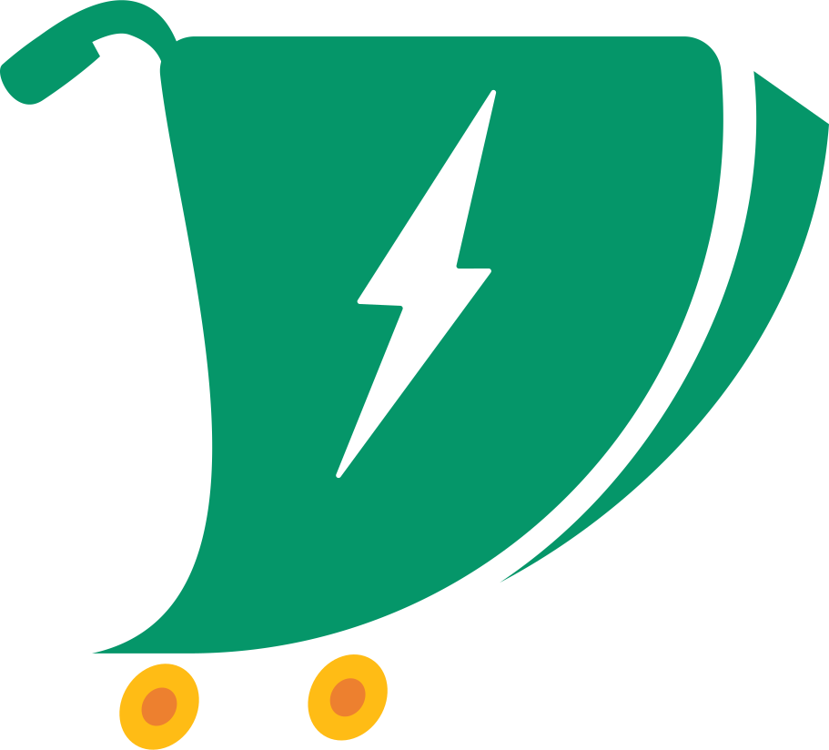

# SoliFood

SoliFood is a web application developed by a team from ENSET Mohammedia and GDSC (Google Developer Students Club) to address the global challenges of food wastage and hunger. It is designed to connect sellers with surplus food to buyers seeking affordable, nutritious alternatives.

## Features

- **User-Friendly Interface**: Built using the Angular framework, SoliFood provides an intuitive platform for sellers to post surplus food items and for buyers to browse and purchase meals.
- **Scalability**: Leveraging Firebase, SoliFood is scalable to accommodate a growing user base without compromising performance.
- **Environmental Impact**: By reducing food waste, SoliFood contributes to environmental sustainability while addressing hunger.

## Getting Started

To run SoliFood locally, follow these steps:

1. Clone the repository: `git clone https://github.com/your-username/SoliFood.git`
2. Install dependencies: `npm install`
3. Set up Firebase:
   - Create a Firebase project and set up authentication, Firestore, and Firebase Storage.
   - Add your Firebase configuration to the environment files.
4. Run the development server: `ng serve`
5. Open your browser and navigate to `http://localhost:4200`

## Architecture

## Contributing

Contributions to SoliFood are welcome! If you have ideas for new features, improvements, or bug fixes, please open an issue or submit a pull request.

## Acknowledgements

SoliFood was developed by **GDSC ENSET team** for the GDSC Solution Challenge 2024. Special thanks to the global GDSC for organizing the challenge.
